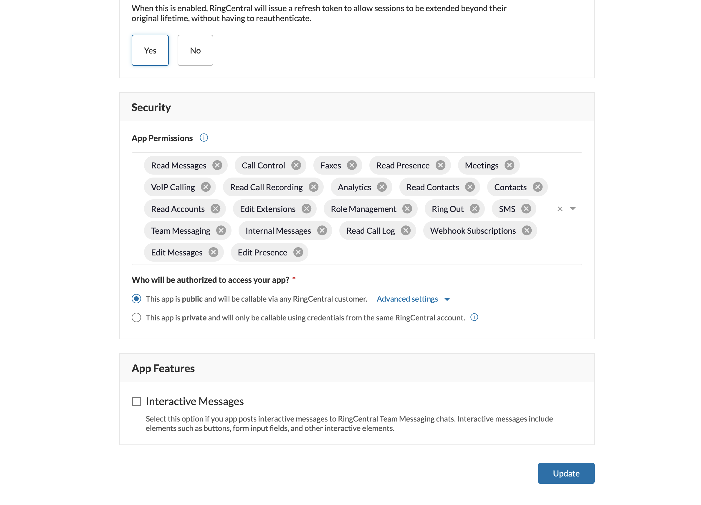

# About
This is a small demo to test a inbound call 
notifications with ring central.

It's done using:
- `ngrok` for the tunneling
- `spring` for the api and the web socket
- `react` as the client

## Dependencies
Given that this is a dockerized application there're only
two real requirements.

1. Docker
2. [Ngrok]('https://ngrok.com/')

The `docker-compose` creates a postgres db with a base script,
sets up the back end api and deployes the react application
on a nginx that will serve as a reverse proxy.

## Using this demo
There's three configurations that must be made for this application

### Setting up Ring Central
We need to create or use two RC apps. One for the react SPA and the
other one for the main account on the spring backend.

The web app and their permissions, note that the callback url on the
second image is always `[NGROK DOMAIN]/callback`




The back end app, it can be either jwt or password base authenticated


### Configuring the resources
The first thing we need to configure are the docker-compose file

```
      - NGROK_DOMAIN=https://2bb3-38-25-17-223.ngrok.io
      - APP_HOOK_URL=https://2bb3-38-25-17-223.ngrok.io/dialer/api/v1/call/hook
      - APP_RINGCENTRAL_SUBSCRIPTIONTTL=86400
      - APP_RINGCENTRAL_URL=https://platform.devtest.ringcentral.com
      - APP_RINGCENTRAL_MAINACCOUNT_CLIENTID=<>
      - APP_RINGCENTRAL_MAINACCOUNT_CLIENTSECRET=<>
      - APP_RINGCENTRAL_MAINACCOUNT_USERNAME=<>
      - APP_RINGCENTRAL_MAINACCOUNT_PASSWORD=<>
      - APP_RINGCENTRAL_MAINACCOUNT_EXTENSION=<>
```

The `NGROK_DOMAIN` and `APP_HOOK_URL` need to have as base the current
ngrok domain. And the other values are from the `back end app` of the ring central.

### Configuring the front.
Finally we need to do a small modification on the front code in the 
route `/front-end/src/components/auth/RingCentralAuth.tsx`.

In here, you must change the `const clientId = "HY6uDzgiTwe-Omm4uzUs3g";`
to the client id of the `spa app` created on ring central.


## Running
If everything went smoothly, you'll have a process on 8080 for the
nginx server, on 8081 for the api and on 5433 for the postgres db